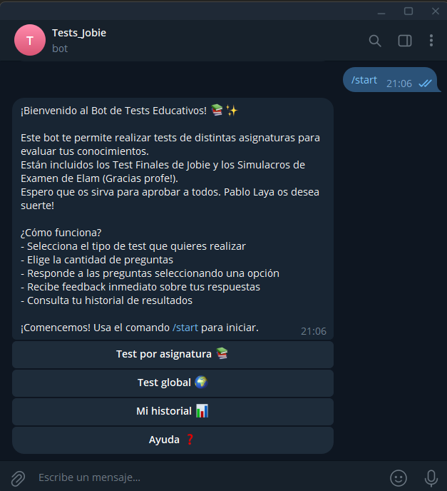
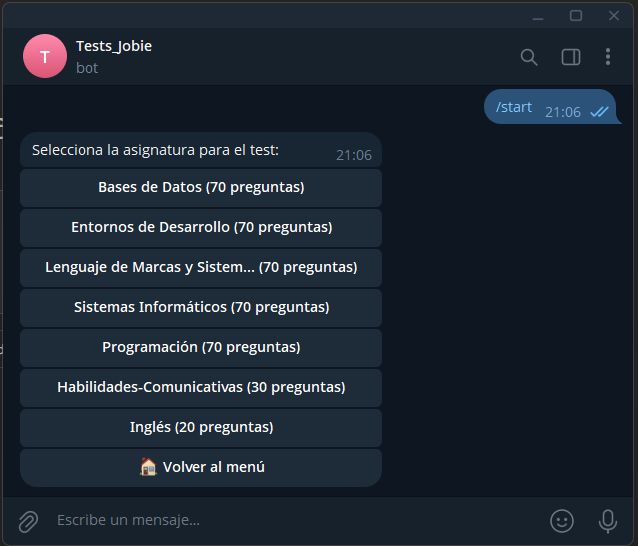
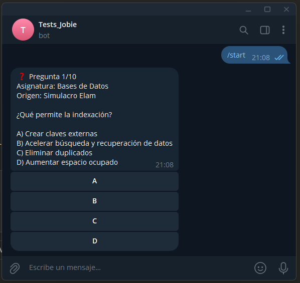
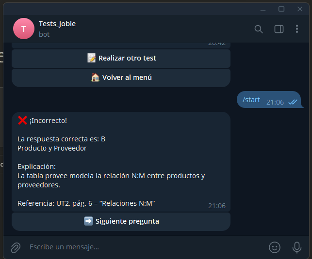

# 📚 Bot de Telegram para practicar tests de FP (DAM/DAW)

Este bot permite practicar preguntas tipo test desde Telegram, ideal para preparar exámenes de ciclos formativos como DAM/DAW. Carga preguntas desde archivos JSON estructurados y registra estadísticas de aciertos y errores.

---

## ✅ Estado del proyecto

💡 **Bot en activo**, alojado en un servidor propio con Ubuntu Server 24/7.  
📱 Usado diariamente por el autor y sus compañeros de clase para preparar los exámenes del primer curso de DAM/DAW.

---

## 👨‍🎓 Sobre el autor

Este proyecto ha sido realizado por **Pablo Laya**, estudiante de 1º de DAM/DAW en Madrid.  
Ha sido desarrollado como parte de su aprendizaje personal, con el objetivo de:

- Entender cómo funciona un bot de Telegram desde cero.
- Aprender sobre estructuras de datos, bases de datos y automatización de procesos.
- Aplicar Python en un proyecto real y útil.

🔍 Se ha contado con el apoyo de herramientas de Inteligencia Artificial como ChatGPT y Claude, para aprender del proceso, resolver dudas, comprender cada parte del código y mejorar el proyecto paso a paso.

---

## 🚀 Características

- Compatible con múltiples asignaturas.
- Estadísticas por usuario.
- Explicaciones y referencias por cada pregunta.
- Integración con SQLite para registrar resultados.
- Extrae preguntas automáticamente desde `.docx` si tienen el formato adecuado.

---

## 🛠️ Instalación

1. Clona este repositorio
2. Instala dependencias:
   ```bash
   pip install -r requirements.txt
   ```
3. Crea un archivo `.env` con tu token de Telegram (puedes copiar el ejemplo):
   ```
   TELEGRAM_TOKEN=tu_token_aquí
   ```

---

## 📦 Estructura de las preguntas (JSON)

```json
{
  "enunciado": "¿Qué significa JVM?",
  "opciones": {
    "a": "Java Virtual Machine",
    "b": "Java Variable Method",
    "c": "Java Version Manager"
  },
  "respuesta_correcta": "a",
  "explicacion": "La JVM es el motor que ejecuta el código bytecode de Java.",
  "referencia": "UT3, pág. 21",
  "origen": "Test Jobie",
  "asignatura": "Entornos de Desarrollo"
}
```

---

## ✍️ ¿Cómo cargar nuevas preguntas?

Puedes:
- Crear los archivos `.json` a mano (ver ejemplo en `data/preguntas.json`).
- O usar el extractor incluido en la carpeta `/extractor/` para generar automáticamente el JSON desde archivos `.docx`.

### ⚙️ Usar el extractor

1. Coloca tus archivos `.docx` en la carpeta `docs/docx/` (debe existir en la raíz del proyecto).
2. Ejecuta el extractor:

```bash
python extractor/extractor.py
```

3. Se generará un archivo `preguntas.json` compatible, que puedes usar con el bot.

> ⚠️ **Importante**: los `.docx` deben seguir un formato específico para que el extractor funcione correctamente (ver ejemplo en `dcos/docx/Bases de Datos_Simulacro Elam.docx`).

---

## 🧪 Vista previa del bot

### Pantalla de bienvenida


### Selección de asignatura


### Ejemplo de pregunta


### Feedback al responder


### Estadísticas de usuario


---

## 📡 Ejecución

```bash
python bot/bot.py
```

---

## 🤖 Tecnologías utilizadas

- Python 3
- python-telegram-bot
- SQLite
- python-docx
- dotenv

---

## 👨‍💻 Autor

**Pablo Laya** — estudiante de 1º de DAM/DAW en Madrid  
🖥️ Apasionado por la automatización, los bots educativos y el aprendizaje continuo.
