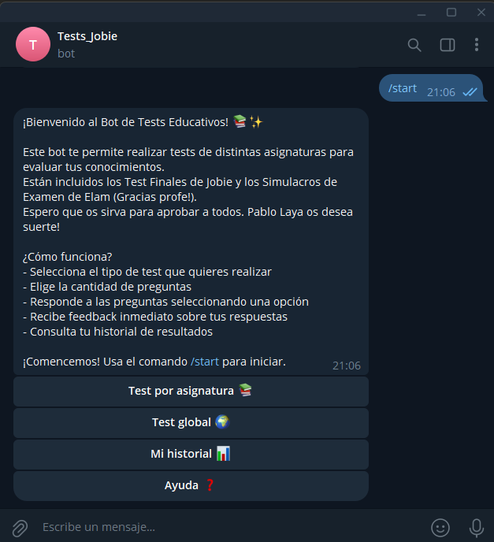
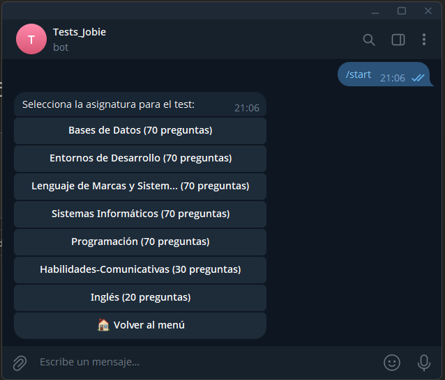
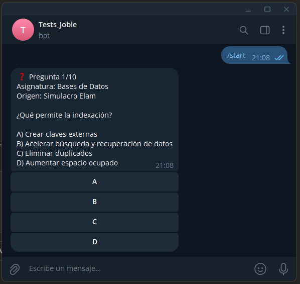
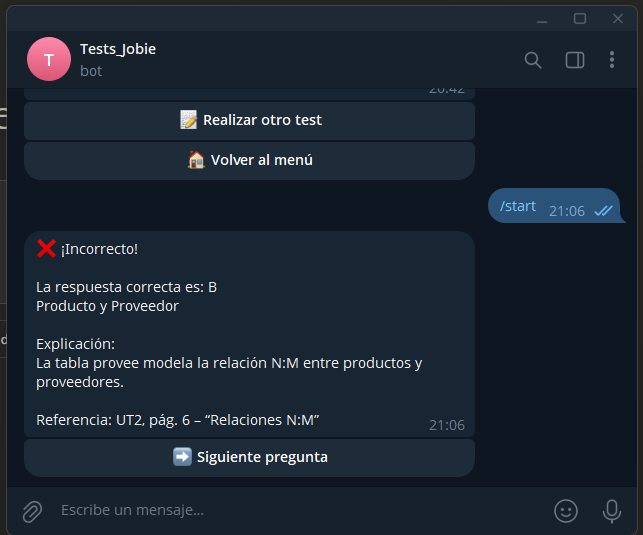
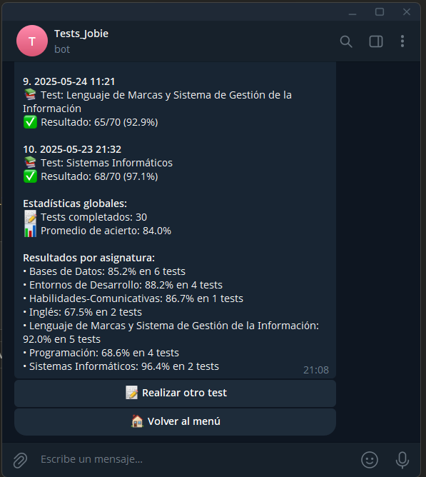

# 📚 Bot de Telegram para Tests Educativos (DAM/DAW)

> **Bot de producción en funcionamiento 24/7**: [@Tests_Jobie_Bot](https://t.me/Tests_Jobie_Bot)

Bot educativo desarrollado para practicar tests de ciclos formativos (DAM/DAW) vía Telegram. Diseñado con arquitectura modular, manejo de estado conversacional y persistencia de datos. **En producción desde mayo 2024** sin intervención manual, sirviendo a ~50 usuarios concurrentes durante períodos de exámenes.

---

## 🎯 Competencias Backend Demostradas

### Arquitectura y Diseño
- **Separación de responsabilidades**: Módulos independientes (`bot.py`, `message_handler.py`, `test_handler.py`, `utils.py`)
- **Patrón FSM (Finite State Machine)**: Manejo de estados conversacionales con `ConversationHandler`
- **Procesamiento ETL**: Extractor modular de datos desde `.docx` → JSON estructurado con validación

### Persistencia y Datos
- **Modelado relacional**: Esquema SQLite con tablas `resultados` y `usuarios`
- **Queries optimizadas**: Agregaciones, filtros y estadísticas con SQL
- **Integridad de datos**: Validación en múltiples capas (parsing, builder, handler)

### Operaciones y Producción
- **Deployment estable**: Ubuntu Server 24/7 desde mayo 2024 sin downtime
- **Logging estructurado**: Rotación automática de logs (5MB límite, 3 backups)
- **Gestión de configuración**: Variables de entorno con `python-dotenv`
- **Manejo robusto de errores**: Try-catch estratégico en puntos críticos

### Procesamiento de Datos
- **Regex avanzado**: Parsing de documentos con 2 formatos diferentes
- **Normalización de texto**: Limpieza, escape de caracteres especiales (Markdown)
- **Validación compleja**: Lógica para 3-5 opciones, respuestas correctas con fallbacks

---

## 🚀 Stack Técnico

```python
# Core
Python 3.x              # Type hints, modern syntax
python-telegram-bot     # Polling architecture, ConversationHandler
SQLite3                 # Embedded database

# Procesamiento
python-docx             # Document parsing
regex (re)              # Pattern matching avanzado

# Utilidades
python-dotenv           # Environment config
logging + RotatingFileHandler
```

---

## 📊 Métricas de Impacto

- **🔄 Uptime**: 6+ meses en producción continua sin mantenimiento
- **👥 Usuarios**: ~50 estudiantes (picos de concurrencia en época de exámenes)
- **📈 Casos de uso**: Preparación exitosa para exámenes de 1º DAM/DAW
- **💾 Datos procesados**: Base de datos con historial completo de tests y estadísticas por usuario

---

## 🛠️ Características Técnicas

### Sistema de Estados Conversacionales
```python
ESTADOS = [
    MENU_PRINCIPAL,
    SELECCION_ASIGNATURA,
    SELECCION_CANTIDAD,
    REALIZANDO_TEST,
    VER_HISTORIAL
]
```

### Procesador de Documentos
- **Parser robusto**: Reconoce 2 formatos de entrada
- **Validación multinivel**: Regex → Builder → Handler
- **Generación de IDs**: Sistema de prefijos basado en asignatura/origen
- **Modo replace/add**: Actualización inteligente de preguntas

### Base de Datos
```sql
-- Esquema relacional con estadísticas agregadas
CREATE TABLE resultados (
    user_id, tipo_test, asignatura,
    correctas, total, porcentaje
);

CREATE TABLE usuarios (
    user_id PRIMARY KEY,
    fecha_registro, ultimo_acceso
);
```

---

## 📁 Arquitectura del Proyecto

```
telegram-test-bot/
├── bot/
│   ├── bot.py              # Entry point + ConversationHandler
│   ├── config.py           # Configuración centralizada
│   ├── message_handler.py  # Lógica de UI/UX
│   ├── test_handler.py     # Gestión de estado de tests
│   └── utils.py            # Persistencia + helpers
├── extractor/
│   ├── docx_parser.py      # Parsing con regex avanzado
│   ├── json_builder.py     # Validación + generación IDs
│   └── utils.py            # Utilidades compartidas
├── data/
│   ├── preguntas.json      # Datos estructurados
│   ├── resultados.db       # SQLite database
│   └── logs/               # Rotating logs
└── docs/
    └── docx/               # Documentos fuente
```

---

## 🔍 Puntos Destacables para Reclutadores

### 1. Código Production-Ready
- Manejo exhaustivo de excepciones
- Logging para debugging y auditoría
- Configuración externalizada (`.env`)
- Validación de datos en origen

### 2. Experiencia en Deployment
- Servidor Ubuntu auto-gestionado
- Proceso persistente sin supervisión
- Zero-downtime en 6+ meses

### 3. Diseño Modular
- Alta cohesión, bajo acoplamiento
- Fácil extensibilidad (nuevas asignaturas, formatos)
- Separation of concerns clara

### 4. Documentación
- README completo con ejemplos visuales
- Docstrings en funciones críticas
- Comentarios estratégicos en lógica compleja

---

## 📸 Capturas del Bot

| Menú Principal | Selección de Asignatura | Pregunta Ejemplo |
|:--------------:|:-----------------------:|:----------------:|
|  |  |  |

| Feedback al Responder | Estadísticas de Usuario |
|:---------------------:|:-----------------------:|
|  |  |

---

## 🚀 Instalación y Uso

### 1. Clonar repositorio
```bash
git clone https://github.com/Prodelaya/telegram-test-bot.git
cd telegram-test-bot
```

### 2. Instalar dependencias
```bash
pip install -r requirements.txt
```

### 3. Configurar token
```bash
# Crear archivo .env
echo 'TELEGRAM_TOKEN="tu_token_de_botfather"' > .env
```

### 4. Ejecutar bot
```bash
python bot/bot.py
```

### 5. Extractor de preguntas (opcional)
```bash
# Colocar .docx en docs/docx/ con formato específico
python extractor/extractor.py
```

---

## 📝 Formato de Preguntas (JSON)

```json
{
  "id": "BDD_SE_001",
  "asignatura": "Bases de Datos",
  "origen": "Simulacro Elam",
  "enunciado": "¿Qué es una base de datos?",
  "opciones": [
    {"letra": "A", "texto": "Un archivo de texto simple"},
    {"letra": "B", "texto": "Un programa para diseño gráfico"},
    {"letra": "C", "texto": "Una colección organizada de datos"}
  ],
  "respuesta_correcta": "C",
  "explicacion": "Las BD almacenan datos estructurados...",
  "referencia": "UT1, pág. 3"
}
```

---

## 🤖 Tecnologías y Librerías

| Categoría | Tecnología | Uso |
|-----------|-----------|-----|
| **Bot Framework** | `python-telegram-bot==13.15` | API de Telegram |
| **Procesamiento** | `python-docx==0.8.11` | Parsing de documentos |
| **Configuración** | `python-dotenv==1.0.0` | Variables de entorno |
| **Database** | `sqlite3` (built-in) | Persistencia de datos |
| **Logging** | `logging.handlers` (built-in) | Logs con rotación |

---

## 👨‍💻 Sobre el Autor

**Pablo Laya** — Estudiante de 2º DAM/DAW en Madrid

🔗 **Enlaces**:
- 🤖 Bot en producción: [@Tests_Jobie_Bot](https://t.me/Tests_Jobie_Bot)
- 💼 GitHub: [github.com/Prodelaya](https://github.com/Prodelaya)
- 📧 Contacto: [proyectos.delaya@gmail.com](mailto:proyectos.delaya@gmail.com)
- 📦 Repositorio: [github.com/Prodelaya/telegram-test-bot](https://github.com/Prodelaya/telegram-test-bot)

### Contexto del Proyecto

Este bot fue desarrollado como proyecto de aprendizaje durante el primer año de DAM/DAW, con el objetivo de:

✅ Entender arquitecturas de bots conversacionales desde cero  
✅ Aplicar Python en un proyecto real con usuarios finales  
✅ Aprender sobre persistencia, parsing y despliegue en producción  
✅ Resolver un problema real: preparar exámenes de forma eficiente  

**Resultado**: Todos los compañeros de clase aprobaron usando el bot como herramienta de estudio.

---

## 🎓 Aprendizajes Clave

- **Arquitectura conversacional**: Implementación de FSM para diálogos complejos
- **Robustez en producción**: Código que funciona 6+ meses sin intervención
- **Procesamiento de datos**: Regex avanzado + validación multinivel
- **DevOps básico**: Deployment + logs + monitoring en servidor propio
- **UX en bots**: Feedback inmediato, estadísticas, navegación intuitiva

---

## 📄 Licencia

MIT License — Ver [LICENSE](LICENSE) para más detalles.

---

## 🙏 Agradecimientos

- **Jobie**: Por los tests finales incluidos en el bot
- **Elam**: Por los simulacros de examen (¡Gracias profe!)
- **Compañeros de DAM/DAW**: Por usar el bot y aportar feedback
- **IA (ChatGPT/Claude)**: Por resolver dudas técnicas durante el desarrollo

---

<p align="center">
  <strong>💡 Proyecto educativo en producción real</strong><br>
  Desarrollado con Python, desplegado en Ubuntu Server, usado por 50+ estudiantes
</p>
